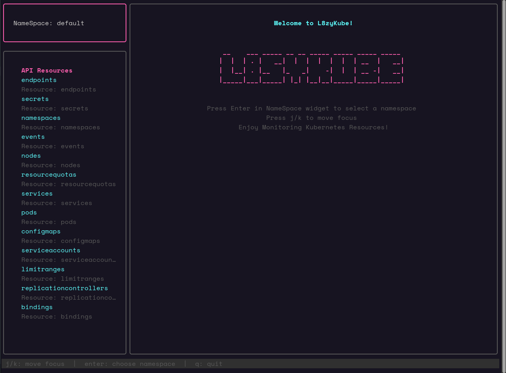

# L8zyKube



## Install 
```
wget https://github.com/ITPATJIDR/L8zyKube/releases/download/v0.0.1/l8zykube
```

### TODO
- Watch resource 
- Delete resource
- Create resource 
    - Can Copy & Paste from Clipboard
- Edit resource 
- Error Optimization
- Switch context
- Monitor Kubernetes status and disk usage


### CanDO
- Select resource filter by namespace
- View logs resource
- Describe resource 
- ApiResouce Can Search
